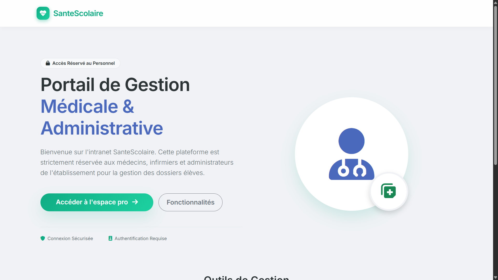
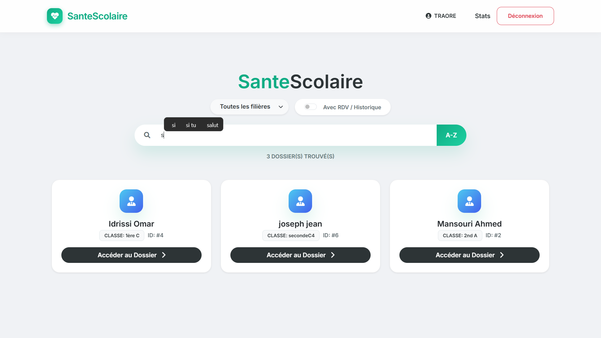

# 🏥 SanteScolaire — Système de Gestion Médicale


**SanteScolaire** est une application web Flask pour digitaliser l'infirmerie d'un établissement scolaire : dossiers élèves, consultations, agenda et statistiques, avec une gestion des accès par rôle (admin, médecin, infirmier).

## Fonctionnalités
- Dossiers élèves et historique médical
- Consultations et rendez-vous
- Tableau de bord et statistiques (Chart.js)
- Administration du personnel médical

## Captures



## Stack
- Python 3.9+, Flask 3.x
- MySQL 8.x
- Bootstrap 5, Chart.js

## Installation rapide
1. Cloner le dépôt
```bash
git clone https://github.com/Godwin-08/SanteScolaire.git
cd SanteScolaire
```
2. Installer les dépendances
```bash
python -m venv .venv
# Windows
.\.venv\Scripts\Activate.ps1
# macOS/Linux
source .venv/bin/activate
pip install -r requirements.txt
```
3. Créer la base MySQL `gestion_hospitaliere_scolaire` et charger votre schéma.
4. Lancer l'application
```bash
python app.py
```

## Configuration (optionnel)
- `SECRET_KEY` : clé de session
- `DB_PASSWORD` : mot de passe MySQL

## Notes
- Un compte admin de démonstration est codé en dur (ID `0`, Nom `Admin`) dans `auth.py`. À remplacer pour un usage réel.
- Le script SQL n'est pas inclus dans ce dépôt.

## Auteur
- Godwin — ENSA Khouribga (IID)
