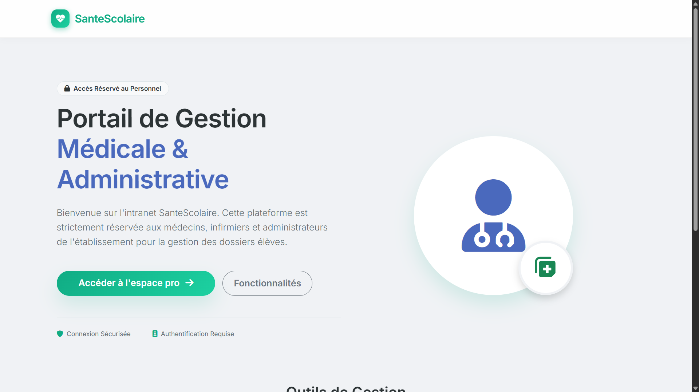
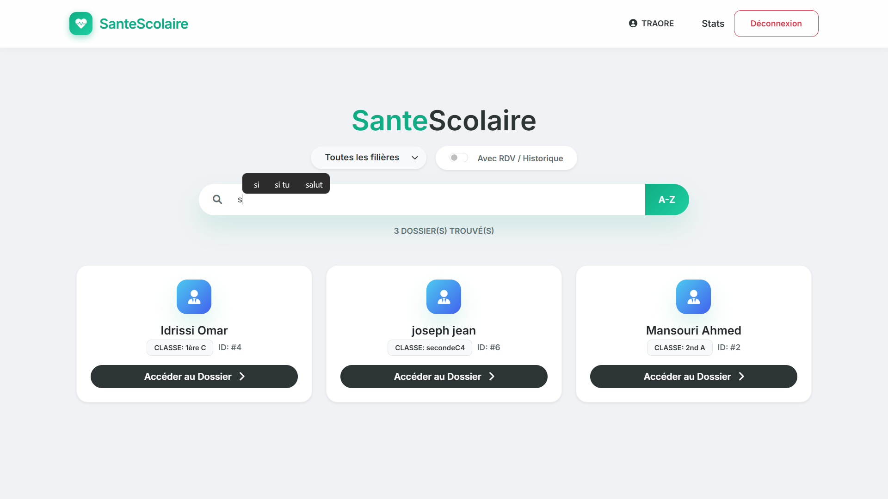

# SanteScolaire — Système de gestion médicale scolaire


**SanteScolaire** est une application web Flask pour digitaliser l'infirmerie d'un établissement scolaire : dossiers élèves, consultations, agenda et statistiques, avec une gestion des accès par rôle (admin, médecin, infirmier).

## Points clés
- Dossiers élèves et historique médical
- Consultations et rendez-vous
- Tableau de bord et statistiques (Chart.js)
- Administration du personnel médical

## Captures



## Stack
- Python 3.9+, Flask 3.x
- MySQL 8.x
- Bootstrap 5, Chart.js

## Installation rapide
1. Cloner le dépôt
```bash
git clone https://github.com/Godwin-08/SanteScolaire.git
cd SanteScolaire
cd backend
```
2. Installer les dépendances
```bash
python -m venv .venv
# Windows
.\.venv\Scripts\Activate.ps1
# macOS/Linux
source .venv/bin/activate
pip install -r requirements.txt
```
3. Importer le schéma MySQL
```bash
cd backend
mysql -u root -p < database/schema.sql
```
4. (Optionnel) Charger des données de démo
```bash
cd backend
mysql -u root -p < database/seed.sql
```
5. Lancer l'application
```bash
cd backend
python app.py
```

## Identifiants de démo (si seed.sql chargé)
| Rôle | ID | Prénom | Nom | Mot de passe |
| --- | --- | --- | --- | --- |
| Admin | 1 | - | Admin | admin123 |
| Médecin | 1 | Karim | Amrani | KARI-1-M |
| Infirmier | 1 | Youssef | Berrada | YOUS-1-I |

**Connexion :** pour médecin/infirmier/admin, saisir l'**ID** et le rôle, puis le mot de passe.

## Configuration
Créer un fichier `.env` dans `backend/` (ou définir des variables d'environnement).
Vous pouvez partir de `.env.example`.

- `SECRET_KEY` : clé de session
- `DB_PASSWORD` : mot de passe MySQL (requis, laisser vide si pas de mot de passe)
- `MYSQL_HOST` : hôte MySQL (optionnel, défaut `localhost`)
- `MYSQL_USER` : utilisateur MySQL (optionnel, défaut `root`)
- `MYSQL_DB` : base MySQL (optionnel, défaut `gestion_hospitaliere_scolaire`)

## Structure
- `backend/app/` : application Flask (blueprints, services, etc.)
- `backend/app/blueprints/` : routes et logique web
- `backend/app/models.py` : modèles SQLAlchemy (migrations)
- `backend/app/services/` : services (ex: emails)
- `frontend/templates/` : templates Jinja2
- `frontend/static/` : assets statiques (CSS/JS)
- `backend/database/schema.sql` : schéma MySQL
- `backend/database/seed.sql` : données de démo (optionnel)
- `backend/app.py` : point d'entrée développement
- `backend/wsgi.py` : point d'entrée déploiement

## Notes
- Les comptes médecins/infirmiers doivent changer leur mot de passe à la première connexion.
- Si l'admin laisse le mot de passe vide lors de l'ajout, l'utilisateur doit activer son compte via `/activate` et definir son mot de passe.
- Un guide de démonstration est disponible dans `DEMO.md`.

## Migrations (Flask-Migrate)
```bash
cd backend
flask --app app:create_app db init
flask --app app:create_app db migrate -m "init"
flask --app app:create_app db upgrade
```

## Tests
```bash
cd backend
pip install -r requirements-dev.txt
pytest
```

## Auteur
- Godwin — ENSA Khouribga (IID)
